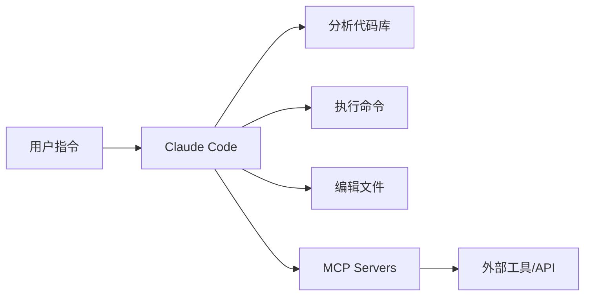

# 什么是 Claude Code？

Claude Code 是 Anthropic 官方推出的命令行界面（CLI）工具，专为软件开发者设计，旨在通过 AI 辅助提升开发效率。

## 核心特点

### 1. 强大的代码理解能力

Claude Code 能够：
- 阅读和理解整个代码库
- 分析代码结构和依赖关系
- 提供上下文相关的建议

### 2. 自主任务执行

不同于传统的 AI 对话工具，Claude Code 可以：
- 自动执行命令
- 编辑和创建文件
- 运行测试和构建
- 提交代码和创建 PR

### 3. 可扩展性

通过以下机制扩展功能：
- **MCP Servers** - 连接外部工具和服务
- **Sub-Agents** - 创建专业化的 AI 助手
- **Slash Commands** - 自定义命令
- **Hooks** - 响应特定事件

## 与其他工具的区别

| 特性 | Claude Code | GitHub Copilot | ChatGPT |
|------|-------------|----------------|---------|
| 代码补全 | ✅ | ✅ | ❌ |
| 自主执行任务 | ✅ | ❌ | ❌ |
| 文件系统操作 | ✅ | ❌ | ❌ |
| 可扩展性 | ✅✅ | 有限 | ❌ |
| 上下文理解 | ✅✅ | 有限 | 有限 |

## 典型使用场景

### 日常开发

```bash
# 实现新功能
$ claude "添加用户认证功能"

# 修复 Bug
$ claude "修复登录页面的样式问题"

# 代码重构
$ claude "重构 UserService，使用依赖注入模式"
```

### 项目管理

- 自动化测试和构建
- 生成和更新文档
- 代码审查和质量检查
- 创建 PR 和管理 Git

### 学习和探索

- 理解复杂代码库
- 学习新技术栈
- 最佳实践建议

## 工作原理



1. **理解需求** - 分析用户指令和项目上下文
2. **制定计划** - 规划执行步骤
3. **执行任务** - 自主完成开发任务
4. **反馈结果** - 报告执行情况

## 开始使用

准备好开始了吗？

👉 [安装和配置](/getting-started/installation)

## 相关资源

- [官方文档](https://docs.claude.com/claude-code)
- [GitHub 仓库](https://github.com/anthropics/claude-code)
- [MCP 协议](https://modelcontextprotocol.io/)
